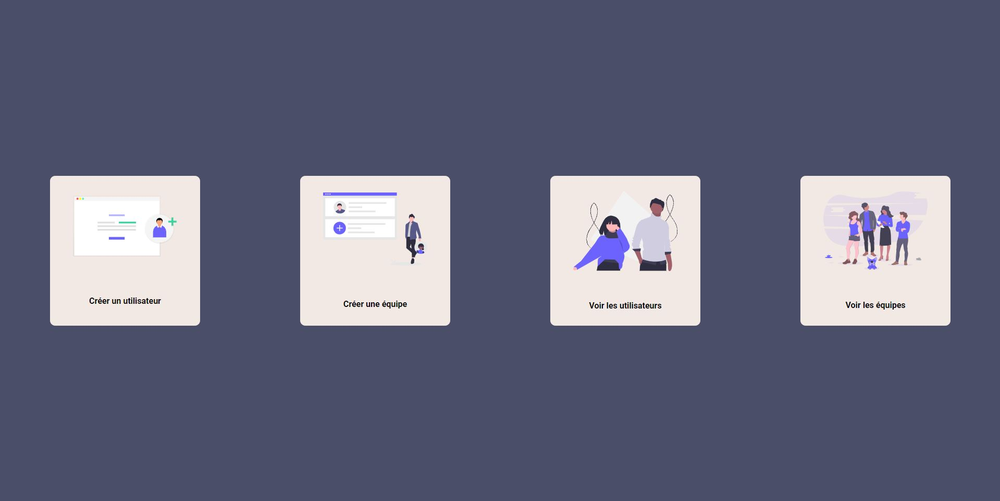

<h1 align="center">User management</h1>

<p align="center">
  
</p>

<p align="center">Demo: <a href="https://trusting-lewin-546ba8.netlify.app" target="_blank">https://trusting-lewin-546ba8.netlify.app</a>
</p>

<p align="center">
 This project was bootstrapped with <a href=https://github.com/facebook/create-react-app target="_blank">Create React App</a>
</p>

## Overview

**Languages, frameworks and libraries**

- React
- Apollo Client
- React Router Dom
- React Hook Form
- yup
- React Table
- styled-components

**Functionalities**

- Create a user
- Create a team
- See users
- See teams
- Update a user

**UI**

- Homemade UI without framework

## Running the project

Clone this repository :

```
git clone https://github.com/GuillaumeBe/User-Management-Front-End.git
cd User-Management-Front-End
```

Install packages :

```
npm install
```

When installation is complete, run the project with:

```
npm start

```

## Deployment

- Client deployed with Netlify

## API

<a href="https://github.com/GuillaumeBe/User-Management-Back-End" target="_blank">https://github.com/GuillaumeBe/User-Management-Back-End</a>

## Contact

<a href="https://www.linkedin.com/in/guillaumebettin" target="_blank">My Linkedin Profile</a>
